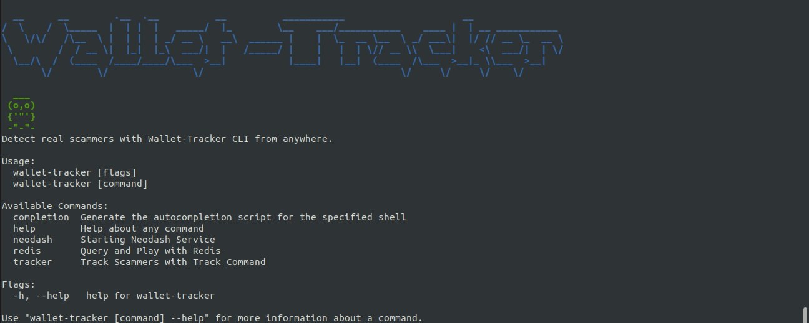
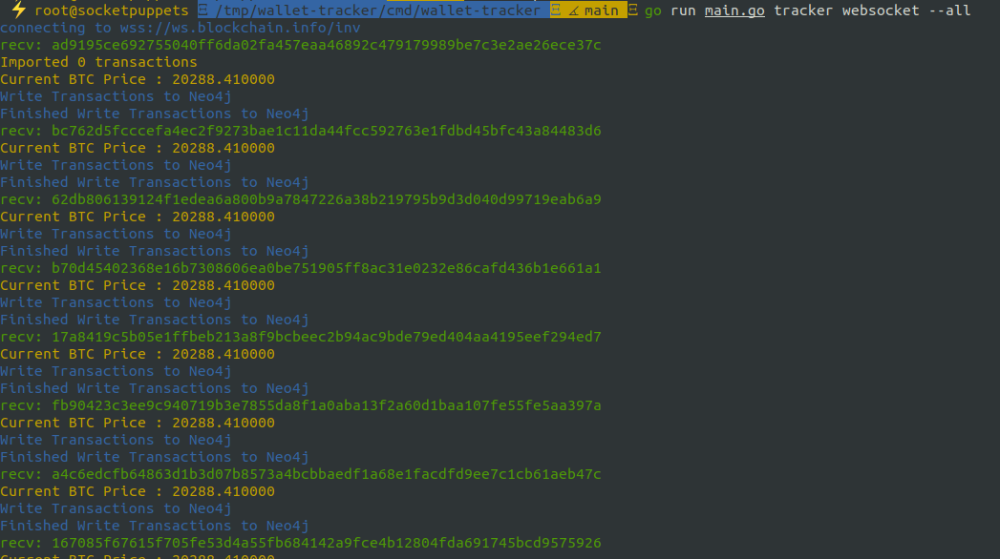
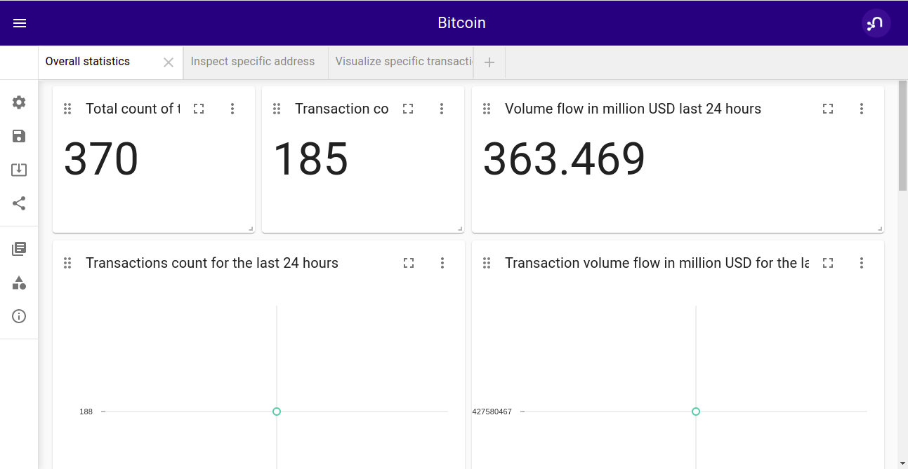
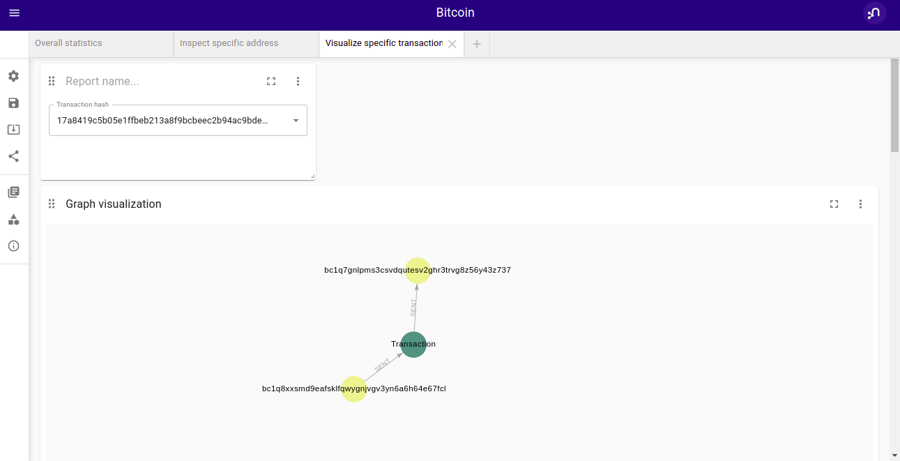
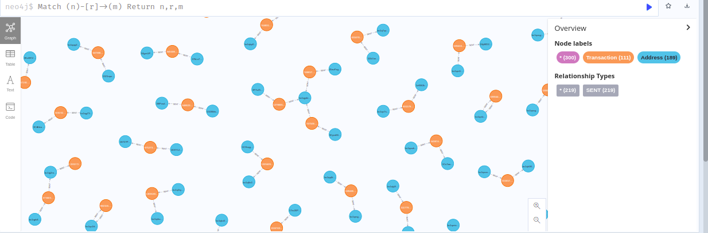

<!-- GETTING STARTED -->

## Getting Started

General information about setting up Wallet Tracker CLI locally




## Installation

```bash
go get github.com/hack-parthsharma/wallet-tracker
```

<!-- USAGE EXAMPLES -->

## Usage

### Track Wallet

After you have install requirements , you can simply track the wallet via:

```shell
   $ wallet-tracker tracker track --wallet 37oTUqiViE3YySs8xxAtKgTzQgoVuSVbse
```

### Track Wallet with Network

If you want to specify network ( you don't need that for now ) use this command:

```shell
   $ wallet-tracker tracker track --wallet 37oTUqiViE3YySs8xxAtKgTzQgoVuSVbse --network BTC
```

### Get All Transactions

If you want to get all transactions from websocket use this command:

```shell
   $ wallet-tracker tracker websocket --all
```




### Detect Exchanges on Exit Nodes

If you want to Detect Exchanges on Exit Nodes use this command:

```shell
   $ wallet-tracker tracker track --wallet 37oTUqiViE3YySs8xxAtKgTzQgoVuSVbse --detect-exchanges
```

### Start Neodash

If you want to visualize Wallets and Transactions using Neo4J database use this command:

```shell
   $ wallet-tracker neodash start
```



Show specific transaction graph.



Show all graph database




### Get Exchange Wallet

If you want to get exchange wallets use this command:

```shell
   $ wallet-tracker redis get --exchanges uniswap --limit 3
```

## Build

Basic building process like the following would suffice.

```shell
   $ go build -o wallet-tracker cmd/wallet-tracker/main.go
```

## Downloads

### Tarball

1. Download latest-release for your operating system/architecture
2. Unzip binary and place it somewhere in your path
3. Make it executable

